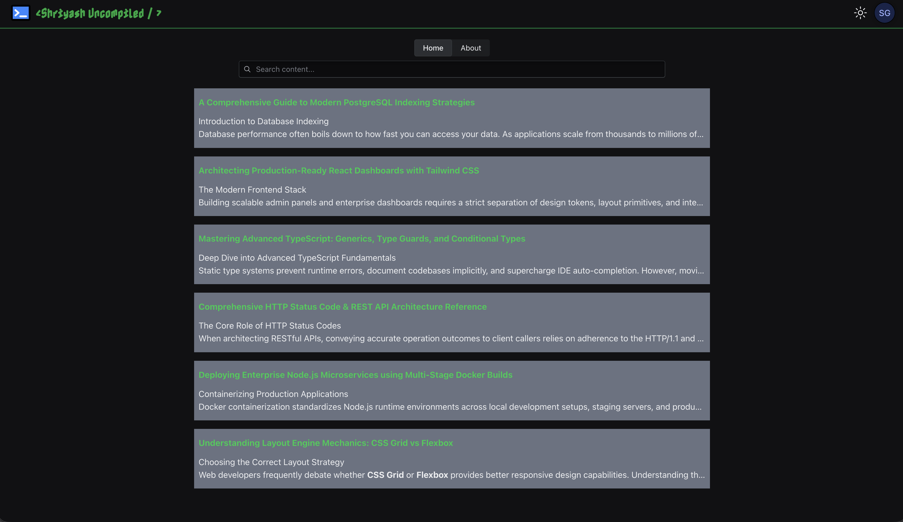
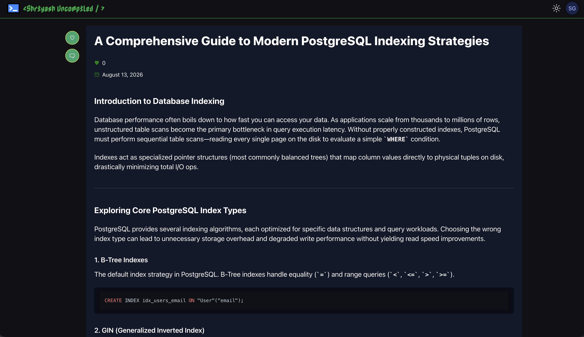
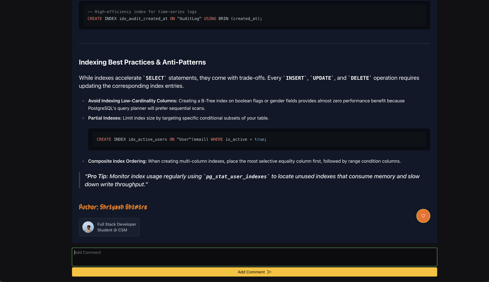

# blog-shriyash

A personal full-stack blog web app with a REST API backend (Node.js / Express / TypeScript / Prisma) and two frontends: one for readers (`client-User`) and one CMS for admins (`client-Admin`).





## Table of Contents

- [Tech Stack](#tech-stack)
- [Acknowledgements](#acknowledgements)
- [Project Structure](#project-structure)
- [Getting Started](#getting-started)
- [Design Choices](#design-choices)
- [Split Architecture](#split-architecture)
- [License](#license)

## Tech Stack

- **Frontend:** React, Redux, TypeScript, Tailwind, React Router, Radix UI, Tailwind Typography
- **Backend:** Express 5, TypeScript, Prisma ORM, PostgreSQL, Supabase
- **Auth:** Passport (JWT strategy), JWT cookies, bcryptjs password hashing
- **Validation:** express-validator
- **Frontends:** `client-User` (public blog with interactive post management), `client-Admin` (admin-side post and comment management)

## Acknowledgements

- **react-markdown** — parses Markdown into HTML elements
- **remark-gfm** — plugin for react-markdown that adds autolink literals, footnotes, strikethrough, tables, and task lists
- **rehype-raw** — parses raw strings into HTML
- **rehype-sanitize** — sanitizes raw HTML
- **rehype-highlight** — applies syntax highlighting to code via lowlight
- **MDXEditor** — powers the WYSIWYG text editor by converting plain strings into Markdown
- **Tailwind Typography** — disables preflight and provides readable typography styles

## Project Structure

```
blog-shriyash/
├── client-Admin/
├── client-User/
└── server/
```

## Getting Started

```bash
npm install
npm run dev
```

This runs all three decoupled applications from the root `blog-shriyash` folder.

### Prerequisites

- Node.js
- A PostgreSQL database (local or cloud)

## ⚠️ CORS (dev builds)

> **CORS is enabled by default and will block cross-origin requests from your local frontends.** You need to disable/relax it for local development, or `client-User` and `client-Admin` won't be able to hit the API.

In `server.ts` (or wherever `cors()` is configured), make sure it allows your dev client URLs and credentials:

```ts
import cors from "cors";

app.use(
  cors({
    origin: [process.env.CLIENT_USER_URL!, process.env.CLIENT_ADMIN_URL!],
    credentials: true, // required — the JWT is sent via an httpOnly cookie
  }),
);
```

- Set `CLIENT_USER_URL` and `CLIENT_ADMIN_URL` in `server/.env` to match your local dev ports (e.g. `http://localhost:5173`, `http://localhost:5174`).
- `credentials: true` is required on **both** the server's `cors()` config and the frontend's fetch/axios calls (`credentials: "include"` / `withCredentials: true`), otherwise the `auth_token` cookie won't be sent or accepted.
- **Do not** ship a wide-open `origin: "*"` config to production — lock it down to your actual deployed client URLs before deploying.

## Design Choices

- **JWT over sessions:** I chose JWT-based auth instead of session-based auth (unlike my other project) to get hands-on experience with it. To keep it secure, the JWT is stored in a cookie with `httpOnly: true`, `sameSite: "lax"`, an expected algorithm of `["HS256"]`, and `secure: true` in production. This protects against XSS-based token theft while preserving the horizontal scalability JWTs offer over server-side sessions.

- **Different token lifetimes:** Members get a 7-day token, since frequent re-logins would be annoying for casual readers. Admins get a 2-day token — admin accounts (i.e., me) carry more privilege and are more costly if compromised, so I'm fine re-entering my password every two days.

- **react-markdown over `dangerouslySetInnerHTML`:** react-markdown sanitizes input by default, which makes rendering user/markdown content much safer and simpler.

## Split Architecture

- I built two separate frontends: one for consuming content, and one CMS for managing it. The CMS is still in progress but will be a simple WYSIWYG setup built on Markdown.

- Monorepos can get messy, so I made sure files are segregated cleanly — each sub-app has its own `package.json`, `.env`, and `.gitignore`. If I ever wanted to split this into separate repos, the migration would be straightforward. Each part also runs in its own sandboxed environment, which keeps data and dependencies from leaking across apps.

- All client-side input is validated both in the UI and on the server (via express-validator). Anything written to the database goes through parameterized queries, so user input is never treated as executable code.

- The CMS reuses a lot of components from the user-facing frontend. The most interesting challenge was implementing a WYSIWYG text editor — I used the MDXEditor library, which turned out to be excellent and highly customizable (need a toolbar? It's a plugin away. Undo/redo? Same.). One snag: Markdown doesn't support underline natively, and I wanted that feature, so I had to write a small plugin to insert `<u></u>` tags manually. The flow ends up being: pull post content from the database → parse Markdown to a string → convert the string to HTML → sanitize the HTML → apply styles.

- I learned a lot building this — more than fits here. I'll go into a deeper dive on _&lt;Shriyash Uncompiled /&gt;_.

## License

ISC
